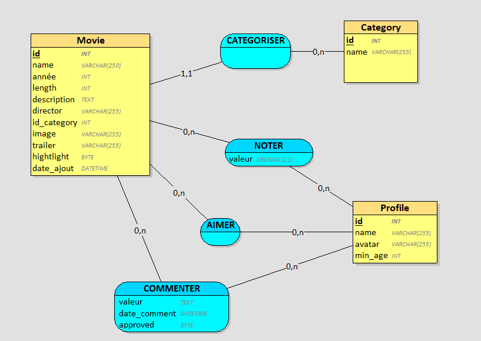

# Documentaion Base de Données

## caridinalités

### movie -- category :
un film est catégorisé au minimum par **1** catégorie et au maximum par **1** catégorie **(1;1)**

une catégorie peut catégoriser au minimum **0** film et au maximum **n** film
**(0;n)**

### movie -- profile :
un film est aimé au minimum par **0** profil et au maximum par **n** profil
**(0;n)**

un profil peut aimer au minimum **0** film et au maximum **n** film
**(0;n)**

### profile -- movie :
un profil peut noter au minimum par **0** film et au maximum par **n** film
**(0;n)**

un film peut être noté au minimum par **0** profil et au maximum **n** profil
**(0;n)**

### profile -- movie :
un profil peut commenter au minimum par **0** film et au maximum par **n** film
**(0;n)**

un film peut être commenté au minimum par **0** profil et au maximum **n** profil
**(0;n)**

## Type de donnée

Chaque table de ma base de données possède une clé primaire id qui utilise une auto-incrémentation. Cet id permet de les différencier les uns des autres et de pouvoir les sélectionner plus facilement sans risque de confusion avec une autre valeur.
J'ai utilisé en grande majorité des varchar(255) pour les textes courts afin de ne pas permettre un texte trop long et réserver assez de place dans la base de données.
Pour la mise en avant et les commentaires approuvés, j'ai utilisé des tinyint(1) (BYTE sur looping) pour simuler un booléen true (1) false (0)
J'ai aussi utilisé le type text pour les descriptions, les commentaires pour permettre des textes longs et enfin j'ai utilisé un datetime pour la date d'ajout des films et la date des commentaires avec la fonction current_timestamp() permettant de stocker par défaut la date et l'heure actuelle sans avoir besoin de le remplir manuellement.

## SQL

SELECT 'Profil le plus actif' AS name, Profile.name as value, COUNT(Favorite.id_profile) + COUNT(Note.id_profile) as total
FROM Profile 
INNER JOIN Favorite ON Favorite.id_profile = Profile.id
INNER JOIN Note ON Note.id_profile = Profile.id
GROUP BY Profile.id
ORDER BY total DESC LIMIT 1

SELECT 'Nombre de commentaires' as name, COUNT(*) as value
FROM Comment

SELECT 'Nombre de commentaires approuvé' as name, SUM(CASE WHEN approved = 1 THEN 1 ELSE 0 END) as value
FROM Comment

SELECT 'Nombre de commentaires en attente' as name, SUM(CASE WHEN approved = 0 THEN 1 ELSE 0 END) as value
FROM Comment

SELECT 'Moyenne de favoris par profil' AS name, ROUND(AVG(fav_count)) AS value 
FROM (
    SELECT COUNT(Favorite.id_movie) AS fav_count 
    FROM Profile 
    LEFT JOIN Favorite ON Favorite.id_profile = Profile.id 
    GROUP BY Profile.id
) AS avgResult

SELECT Movie.id, Movie.name,  Movie.image, Movie.id_category, Movie.highlight, Movie.date_ajout, Category.name AS label FROM Movie INNER JOIN Category ON Category.id = Movie.id_category WHERE min_age <= :min_age AND (LOWER(Movie.name) LIKE :searchvalue OR LOWER(Category.name) LIKE :searchvalue OR Movie.year LIKE :searchvalue) ORDER BY Category.name

UPDATE Movie SET highlight = :highlight WHERE id = :id

SELECT valeur FROM Note WHERE id_movie = :idmovie AND id_profile = :idprofile

INSERT INTO Note (id_movie, id_profile, valeur) 
VALUES (:idmovie, :idprofile, :valeur)

SELECT Comment.content, Comment.date_comment, Profile.name AS name FROM Comment
INNER JOIN Profile ON Profile.id = Comment.id_profile 
WHERE id_movie = :idmovie AND Comment.approved = 1
ORDER BY Comment.date_comment DESC

INSERT INTO Comment (id_movie, id_profile, content) 
VALUES (:idmovie, :idprofile, :valeur)

SELECT Comment.id, Comment.approved, Comment.content, Comment.date_comment, Profile.name AS name FROM Comment
INNER JOIN Profile ON Profile.id = Comment.id_profile 
WHERE Comment.approved = 0
ORDER BY Comment.date_comment DESC

UPDATE Comment SET approved = :approved WHERE id = :id

DELETE FROM Comment WHERE id = :id

## Explication

getAllmovies, getMovieDetail et getAllFavorite récupèrent les données avec SELECT dans la base de données dans plusieurs tables. INNER JOIN permet de lier les films avec leur catégorie

getAllMovies, getMovieDetail, getAllFavorite, getHighlightMovies et getAvgFavorites utilise LEFT JOIN qui à la différence de INNER JOIN recupère les films même si certaines donnés ne sont pas présente (ex :getAllMovies cherche à récupérer les notes mais touts les films ne sont pas noté)

Pour le calcul de moyenne, j'ai utilisé ROUND(AVG(valeur),1). Le AVG() calcule la moyenne et le ROUND(AVG(),1) arrondit la valeur à un chiffre après la virgule.

Pour la recherche dynamique des films, getSearchmovies LOWER() permet de forcer les valeurs à être en minuscule pour généraliser la recherche sans prendre en compte la casse et LIKE permet de chercher un film avec la valeur recherchée. Cette valeur est entourée de % pour chercher si la valeur cherchée se trouve au début au centre ou à la fin du film (ex : pour chercher le film "Interstelar", on peut écrire "inter", "stelar", "erste", ...)

SUM(CASE WHEN approved = 1 THEN 1 ELSE 0 END) permet de prendre la somme des commentaires ayant approved = 1
Si le commentaire a approved = 1 alors on ajoute 1 au total sinon on ajoute 0
Le total donne donc le nombre de commentaires approuvés

ORDER BY total DESC LIMIT 1 dans getActiveProfile permet de trier le total de favoris et des notes d'un profil de du plus grand au plus petit et de ne récupérer que la 1ère valeur

Dans getAvgFavorites, le FROM permet de faire une sous-requête permettant de calculer le nombre total de favoris par profil, valeur qui est ensuite utilisée pour faire une moyenne.

## Modification base de la donnée

Pour les itérations telles que la mise en avant ou le tag new, j'ai rajouté dans la table Movie 2 colonnes pour stocker les valeurs.
J'ai aussi rajouté 4 tables à la base de données : Comment pour stocker les commentaires des utilisateurs, Favorite pour stocker leurs favoris, Note pour stocker les notes de chaque film et quel profil les a données et enfin Profile pour stocker les informations de chaque profil créé.