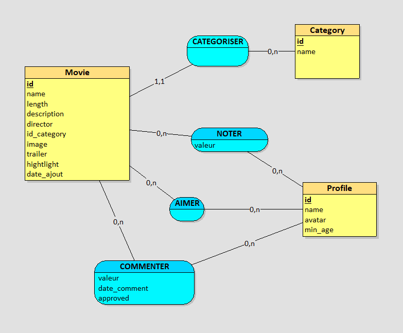

movie -- category :
un film est catégorisé au minimum par 1 categorie et au maximum par 1 categorie
une categorie peut catégorisé au minimum 0 film et au maximum n film

movie -- profile :
un film est aimer au minimum par 1 categorie et au maximum par 1 categorie
une profile peut aimer au minimum 0 film et au maximum n film

profile -- movie :
un profile peut noter au minimum par 0 film et au maximum par n film
une film peut etre noté au minimum par 0 profile et au maximum n profile

profile -- movie :
un profile peut commenter au minimum par 0 film et au maximum par n film
une film peut etre commenté au minimum par 0 profile et au maximum n profile

